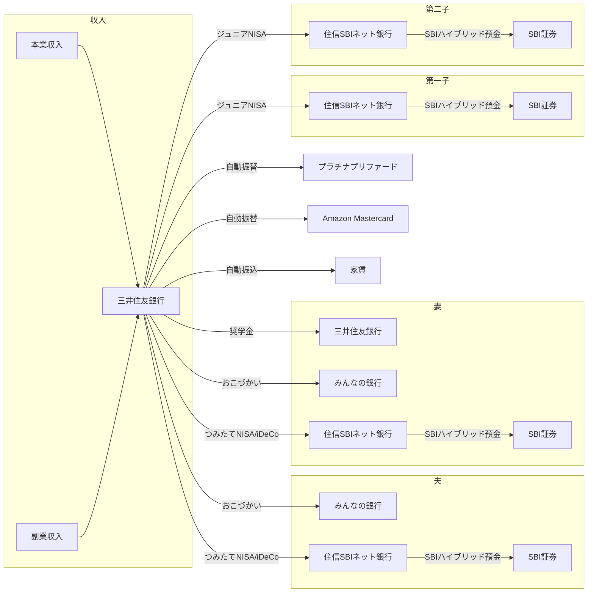

```mermaid
graph LR;

paild[本業収入];
dinii[副業収入];

smcc_pp[プラチナプリファード];
smcc_am[Amazon Mastercard];
rent[家賃];

temma_smbc[三井住友銀行];
temma_oko[みんなの銀行];
temma_sbi[住信SBIネット銀行];
temma_sbisec[SBI証券];

hiroko_smbc[三井住友銀行];
hiroko_oko[みんなの銀行];
hiroko_sbi[住信SBIネット銀行];
hiroko_sbisec[SBI証券];

kiko_sbi[住信SBIネット銀行];
kiko_sbisec[SBI証券];

itsuki_sbi[住信SBIネット銀行];
itsuki_sbisec[SBI証券];

subgraph 収入
	paild --> temma_smbc;
	dinii --> temma_smbc;
end

%%subgraph 支出
	smcc_pp;
	smcc_am;
	rent;
%%end

%%subgraph 振り分け
subgraph 夫
	temma_smbc;
	temma_oko;
	temma_sbi;
	temma_sbisec;
end

subgraph 妻
	hiroko_smbc;
	hiroko_oko;
	hiroko_sbi;
	hiroko_sbisec;
end

subgraph 第一子
	kiko_sbi;
	kiko_sbisec;
end

subgraph 第二子
	itsuki_sbi;
  itsuki_sbisec;
end
%%end

temma_smbc -- 自動振替 --> smcc_pp;
temma_smbc -- 自動振替 --> smcc_am;
temma_smbc -- 自動振込 --> rent;

temma_smbc -- おこづかい --> temma_oko;
temma_smbc -- つみたてNISA/iDeCo --> temma_sbi;
temma_sbi -- SBIハイブリッド預金 --> temma_sbisec;

temma_smbc -- おこづかい --> hiroko_oko;
temma_smbc -- 奨学金 --> hiroko_smbc;
temma_smbc -- つみたてNISA/iDeCo --> hiroko_sbi;
hiroko_sbi -- SBIハイブリッド預金 --> hiroko_sbisec;

temma_smbc -- ジュニアNISA --> kiko_sbi;
kiko_sbi -- SBIハイブリッド預金 --> kiko_sbisec;

temma_smbc -- ジュニアNISA --> itsuki_sbi;
itsuki_sbi -- SBIハイブリッド預金 --> itsuki_sbisec;
```
